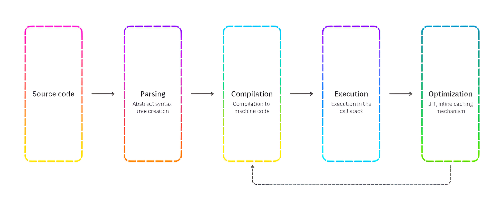
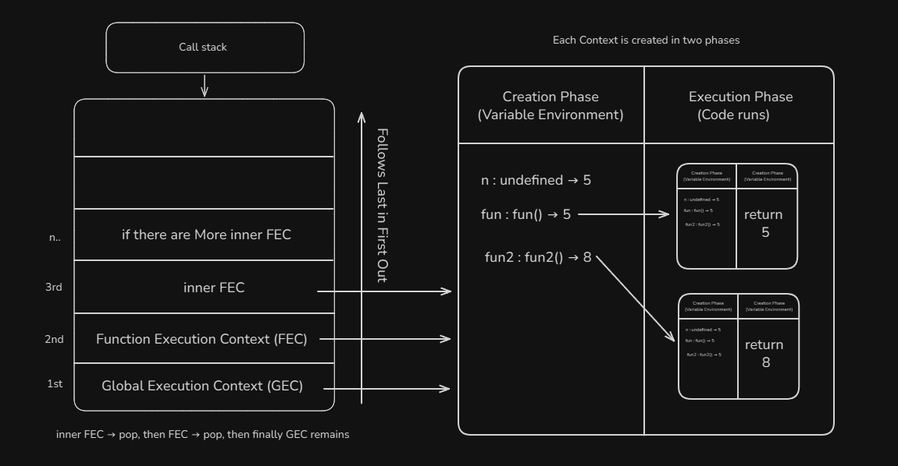

# Introduction

- JavaScript (JS) was created by Brendan Eich in 1995.  
- JS is a programming language used for both frontend (web browsers) and backend (Node.js).  
- Managed by **ECMAScript**: ECMAScript (ES) sets the standards for JavaScript, introducing new features, removing outdated ones, and improving the language over time.

- JS has two major versions:  
  - **ES5** – Older version, still widely used and supported.  
  - **ES6 (ECMAScript 2015)** and beyond – Introduced modern features like `let`, `const`, arrow functions, classes, and more.

---

## Built-In Browser Interfaces

- **DOM**, **BOM**, and **WINDOW** are built-in browser interfaces accessible via JavaScript.  
- Think of it like this:  
  - `WINDOW` is the big box (browser window).  
  - `BOM` (Browser Object Model) is a set of tools inside the box to control the browser.  
  - `DOM` (Document Object Model) is the webpage inside the box.

---

## JavaScript Code Execution Process



1. **Source code** – The JavaScript code you write, usually in a `.js` file.  
2. **Parsing** – The JS engine reads the code and converts it into an **Abstract Syntax Tree (AST)** representing the code’s structure.  
3. **Compilation** – The Just-In-Time (JIT) compiler translates the AST into machine code that the computer understands.  
4. **Execution** – The machine code runs in the **Call Stack**, where functions execute one by one.  
5. **Optimization** – The engine optimizes the code during execution using techniques like JIT compilation, inline caching, and hidden classes to improve performance.

### Key Optimization Techniques

- **JIT Compilation**  
  Instead of translating all code upfront, JIT compiles parts of the code during program execution to speed things up.

- **Inline Caching**  
  When a function accesses the same object property repeatedly, the engine caches the location to avoid repeated lookups.

- **Other Speed-Up Tricks**:  
  - Hidden Classes: Organizes objects internally to speed up property access.  
  - Dead Code Removal: Removes unused code for efficiency.  
  - Loop Unrolling: Rewrites loops to run faster.

---

## JIT Compiler in JavaScript

- Originally, JS used an interpreter, but modern engines like **V8 (Chrome)** use a JIT compiler combining compilation and interpretation for better performance.

- JIT behaves both like an interpreter and a compiler:  
  - Executes code line-by-line for fast startup (interpreter-like).  
  - Compiles frequently used code to machine code for fast execution (compiler-like).

---

## JavaScript Execution Context & Call Stack (How JS code runs behind the scenes)
JavaScript is a **synchronous**, **single-threaded** programming language, which means it can only execute one command at a time, line by line.

### What happens when JS code runs?
When JS code is executed in the browser, it passes through:

1. **Browser**
   - The platform where the javaScript code runs (chrome, firefox etc)
   - It contains the **JavaScript Engine**
2. **JavaScript Engine**
   - A program inside the browser (eg V8 in Chrome) that:
      - **Executes our code**
      - **Allocates memory** to variables and functions
      - Manages the **Call Stack, Heap,** and the **Execution Context**
3. **Execution Context**
   - The environment created by the JavaScript Engine **where each piece of code runs**
   - Every time JS code runs, an execution context is created.
   - Execution Context has:
      - Memory storage (for variabels/functions)
      - Scope (lexical scope chain)
      - Value of `this` keyword

### What's inside every Execution Context?
Every execution context contains three main parts:
1. **Variable Object**
   - It stores:
      - All variables and function declarations
      - Before code starts executing, JS puts them here during the **Creation Phase**
   - **Global Execution Context** → It stores global variables/functions
   - **Function Execution Context** → It stores functions's local variables/parameters

2. **Scope Chain**
   - It's like a path that JS follows to **find variables
   - If a variable is **not found inside a function**, Js goes up to the **Outer environment**
   - This is how **nester functions** can access variables from outer functions

3. **Value of `this` keyword**
   - This is a **special keyword** that refers to "who" is calling the function
   - To know about value of `this` go to [this keyword values](06-JS_Advance.md#Understanding-this-Keyword-in-JavaScript)

### Call Stack (Execution Context Stack)
The **Call Stack** is where execution contexts are **pushed** and **popped** to manage function calls in correct order.


>**Note:**
> - In the creation phase, all `var` are set to `undefined`, and function declarations are stored with their actual function code.
> - In the execution phase, the code runs line-by-line, and each variable and function gets its actual value.

---

## Hoisting in JavaScript
Hoisting is a behavior in JavaScript where **variable** and **function declaration** are moved to the **top of their scope** (memory phase) before the code is executed.

### What Gets Hoisted?
- `var`  → Hoisted and initialized as `undefined`
- `functions` declarations  → hoisted with full function body
- `let` and `const`  → hoisted but **not initialized** because they are in **temporal zone**

### 1. Hoisting with `var`
- Variables declared using `var` are hoisted to the top of their scope (global execution context)
- But they are initialized as `undefined` during the **creation phase** in executuion context
```js
console.log(a); // undefined
var a = 10;
```

### 2. Hoisting with `function` declarations
- Function declarations are fully hoisted
- We can call the function even before it's written in the code

```js
greet(); // Hello

function greet() {
  console.log("Hello");
}
```

### 3. Hoisting with `let` and `const`
