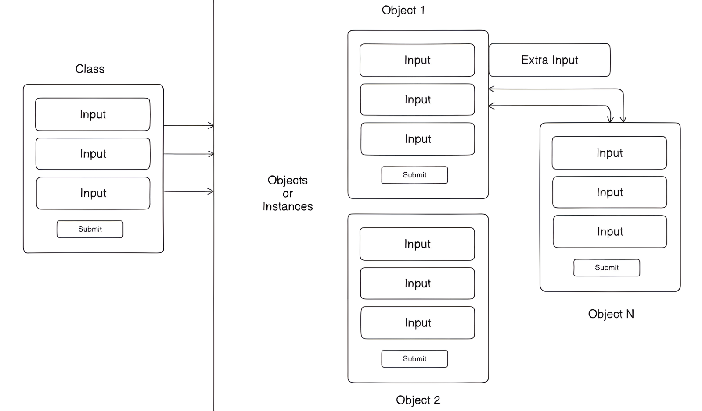

# Object-Oriented Programming in JavaScript

## OOPs and Prototype-Based Programming


### Class
- A **class** is a template or blueprint that defines **data members** (attributes) and **member functions** (methods).
- It doesn’t hold the data itself but serves as a structure for creating objects.

### Objects / Instances
- Multiple **objects** are created from the class, each having the same structure.
- Each object is a unique instance of the class and can also have **additional attributes** individually.

### Modification in an Instance
- An instance (e.g., `object1`) can be modified separately.
- This shows that **JavaScript objects are flexible** — changes to one instance won’t affect the class definition.

---

## Prototype-Based Programming

- In JavaScript, **almost everything has a prototype** when dealing with objects.
- A **prototype** is like a built-in template that provides extra properties or methods to objects, arrays, functions, etc.
- JavaScript is **not a classical OOP language** like Java or C++, but it still supports OOP concepts like inheritance and object creation.

### Prototype Real life Example
> If you make a cake (object), it follows a recipe (prototype).  
> If you add a new feature (like berries), you update the recipe (prototype), and all future cakes can have berries.

---

## Constructors in JavaScript

Constructors are used to **create and initialize objects**. JavaScript supports two types:

### 1. Function-Based Constructor (ES5)

> Older way of creating constructor functions before ES6.

```js
function makeHuman(name, age) { //Function based class
  this.name = name; //Properties, this. assign values
  this.age = age;
}

let ans = new makeHuman("Suraj", 19); //Creates a new blank object
console.log(ans);
```
- `new` keyword creates a blank object.
- `this` assigns values to that blank object.
- This approach mimics class-like behavior.

## 2. Class-Based Constructor (ES6+)
>Introduced in ES6 — modern way to create reusable and clean object structures.
```js
class person {   //class
  constructor(nickname,surname) { //constructor with 2 parameters
    this.nickname = nickname; //attributes
    this.surname = surname;
  }
  method() { //method
    return `This is a method ${this.nickname} and ${this.surname}`;
  }
}
let calling = new person("suraj", 'verma');
console.log(calling.method()) //calling the method
```

- `class` is a blueprint of code which is used to create multiple `objects`
- Helps organize code and supports object-oriented design.
- Use the constructor() method to initialize or assign parameters (properties) to objects when creating them using the new keyword.
